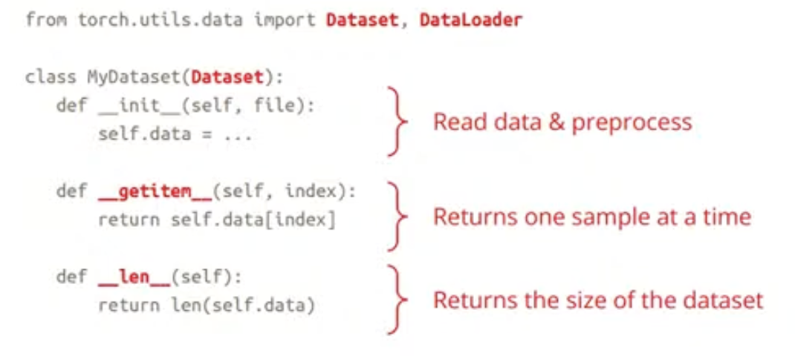
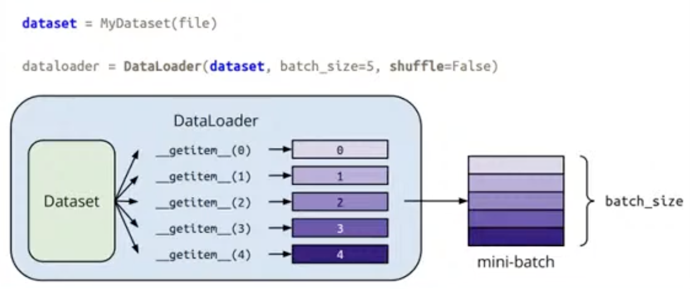

- torch 的 内容，之前已经在 动手学深度学习里学过了，因此这里主要是看了一遍
- 至于Colab，我就不看了，一般不会用

- Dataset & Dataloader
	- 在训练时，dataloader 的 shuffle 设为 True，测试时设为 False
	- 
	- 

- Tensors --- 这个太熟了
	- squeeze\unsqueeze
	- cat
	- reshape\view
	- to(device)
	- 梯度
		- tensor(....., required_grad=True)
		- tensor.backward
		- tensor.grad
	- data type
		- 32bit 浮点数 --- torch.float\torch.FloatTensor
		- 64bit 整数 --- torch.long\torch.LongTensor

- torch.nn --- 这个也熟
	- layer = nn.Linear(in,out)
	- layer.weight\layer.bias
	- nn.Sigmoid()
	- nn.ReLU()
	- nn.Module --- 继承的模块基类
		- 重写 forward\
	- nn.Sequential() --- 搭建序列网络
	- nn.MSELoss()
	- nn.CrossEntropyLoss()

- torch.optim
	- torch.optim.SGD(model.parameters(), lr, momentum)

- 训练 --- model.train()
	
- 测试 --- model.eval() + with torch.no_grad():
	- model.eval()
		- 改变某些模型层的行为，例如dropout和批量归一化
	- with torch.no_grad()
		- 防止计算被添加到梯度计算图中。通常用于防止意外在验证/测试数据上训练

- torch.save(model.state_dict(),path)\torch.load(path)\torch.load_state_dict(ckpt)

