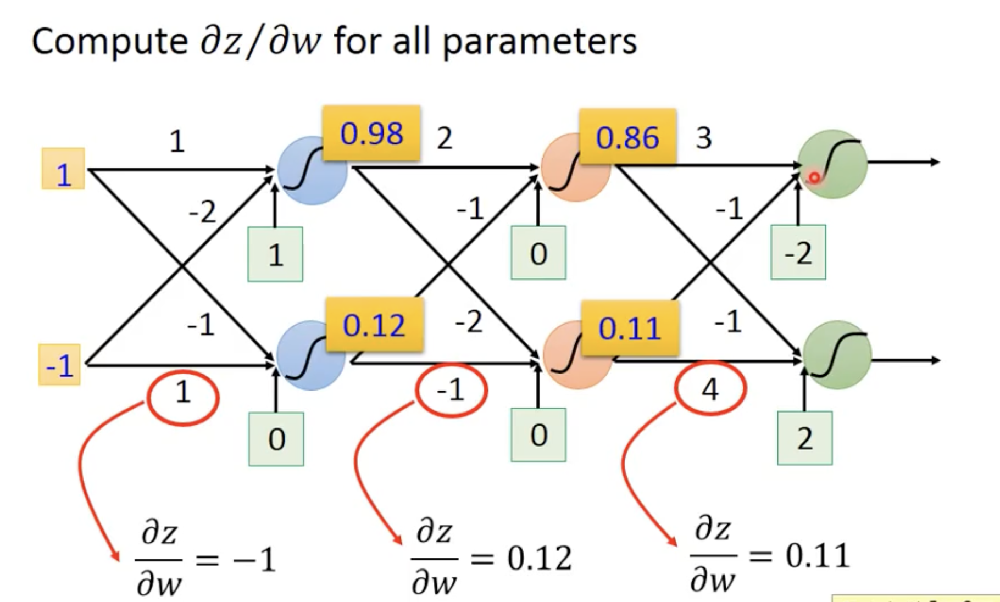
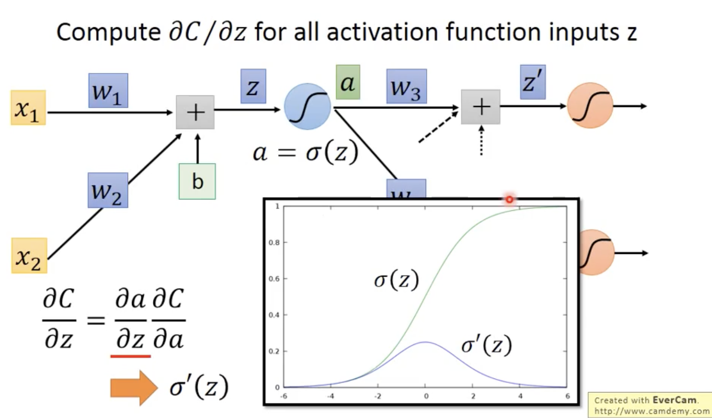
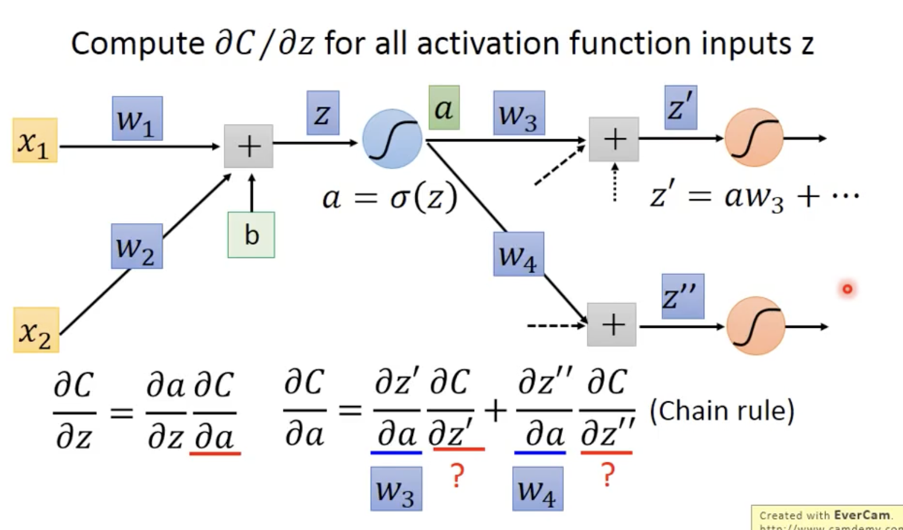
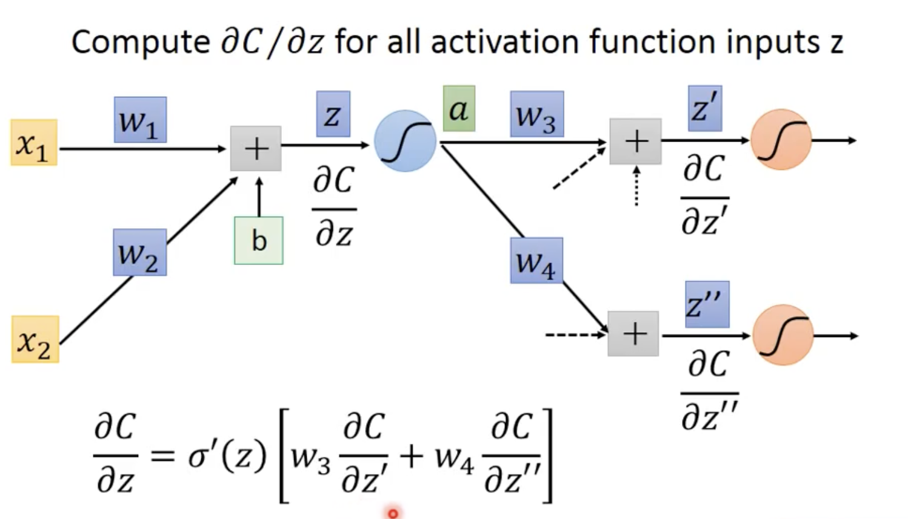
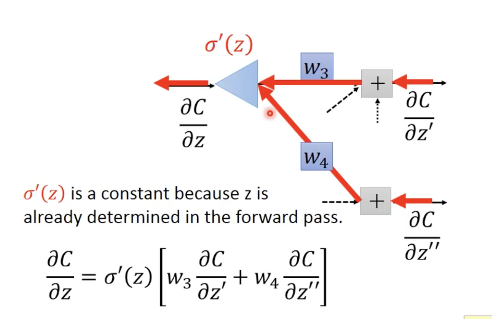
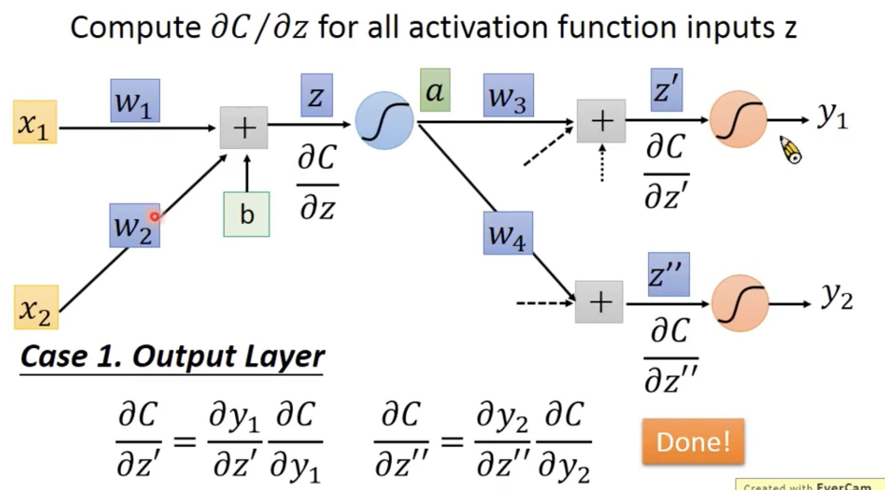
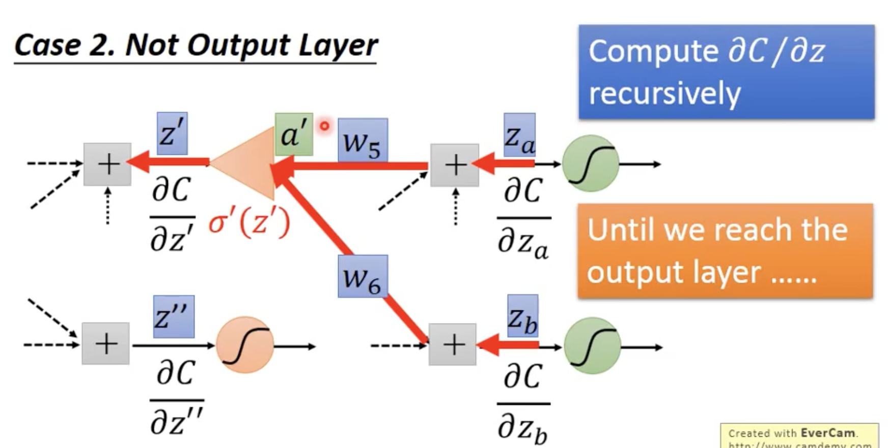

- Chain Rule  --- 微分的Chain Rule 是反向传播的理论基石

- 反向传播
	- Forward pass --- Compute dz/ dw for all parameters
		- 
		- 如上图所示，$z_1=w_{11}\cdot x_{1} + ...$  因此 $dz_{1}/dw_{11}=x_1$ 诸如此类
		- 考虑矩阵相乘，权重矩阵第一列权重的Forward Pass都是 $x_1$ 如此类推
	- Backward pass --- Compute dC / dz for all activation function inputs z
		- 
		- 
		- 
		- 
		- case 1: output Layer
		- case 2: hidden layer

- [自动微分](./自动微分.md)
- [计算图](./计算图.md)