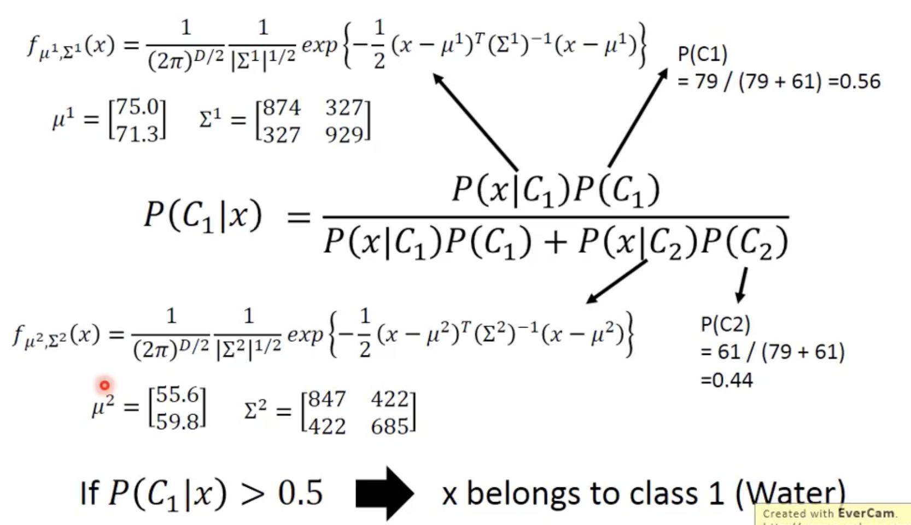
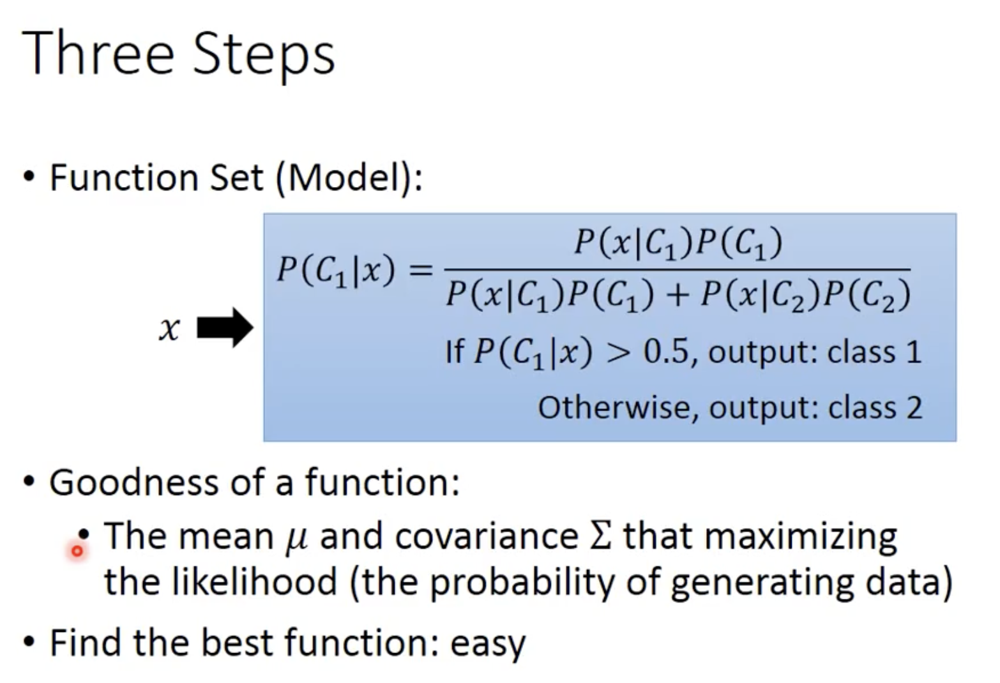
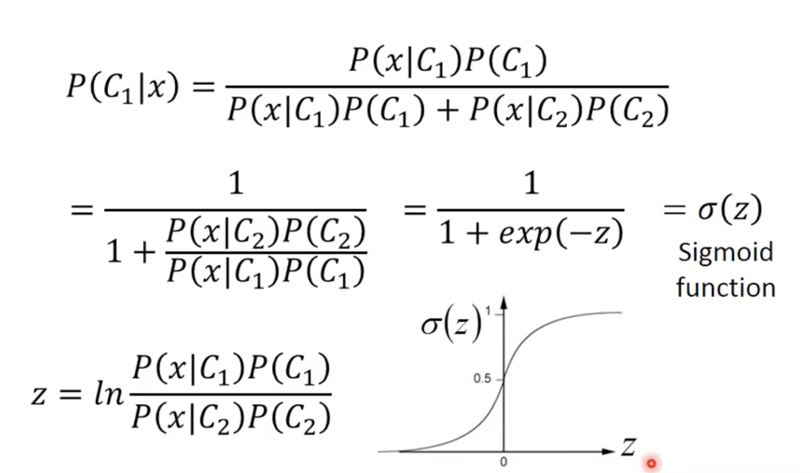

- 本节课介绍了 宝可梦分类的详细过程，进而讲清楚分类任务
	- 先介绍了简单二分类的情形
	- 然后采用Guassian分布说明分类问题
	- 接着讲述了Guassian分布中用同样的 $\sum$ 去做效果更好，这里的 $\sum$ 表示数据的 covariance matrix 协方差矩阵
	- 再接着讲述了其实你不用总是用Guassian分布，也可以使用其它分布，比如你甚至还可以用 朴素贝叶斯分布(这个我在CS188中学过)
	- 最后从数学层面讲述了为什么$\sum$ 取一样的看起来就是线性的，以及从数学层面讲述了它类似于线性model+sigmoid 函数做二分类
	- 要点
		- 分类问题可以视作是 Maximum Likelihood，这里使用 Gaussian 分布去做最大似然的，比如先用 水系宝可梦数据得到一个Gaussian 分布，再用 普通系宝可梦数据得到另一个Gaussian分布，然后看新来的数据更可能从那个分布中采样出，就属于那个分布
			- 
		- 课中发现用同样的 $\sum$ 效果更好
		- 基于高斯分布的分类
			- 
		- 基于概率分布方法的二分类
			- 
			- 