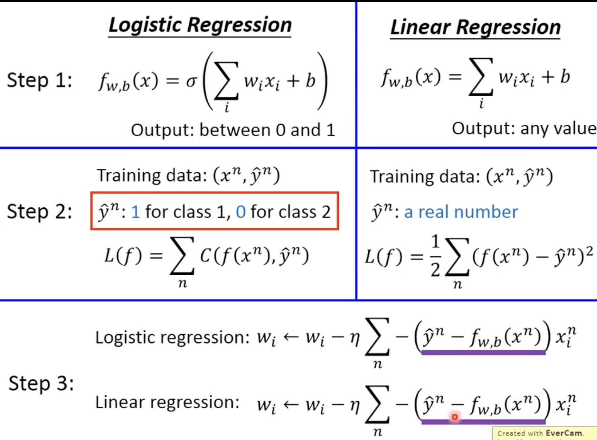
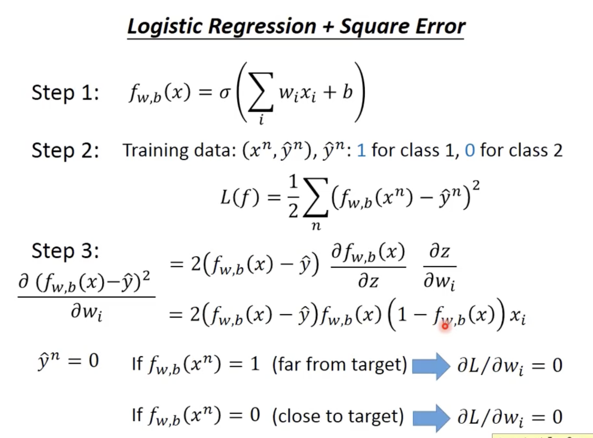

- 本节课是接着 S-4 讲的，在S-4的分析中我们发现其实最终我们的model 和 线性model + sigmoid 函数做二分类本质上相似，因此本节我们就介绍 逻辑回归。对于二分类逻辑回归就是 sigmoid(可以将输出视作是正类的概率)，而对于 多分类 逻辑回归就是 softmax
	- 先介绍 逻辑回归的基础
	- 再介绍 逻辑回归的损失还介绍了交叉熵 --- BCE
	- 再然后介绍 逻辑回归的训练
	- 接着对比了 逻辑回归 和 线性回归，同时说明了 逻辑回归搭配MSE在梯度上是有严重问题的(这里就发人深省了，有些loss看上去合理但是梯度并不合理，因此在分析Loss算法时梯度需要严肃考虑)
	- 再接着对比了 Discriminative 和 Generative 方法
	- 最后讲解了 多分类的情况 使用 softmax --- CE
		- 同时讲解了 逻辑回归的缺陷，如果只是单一的一层且没有激活函数，只有最后的sigmoid或者softmax，其本质也是线性的分类，但是我们可以利用P-1学到的知识明白利用 激活函数 + hidden layer 是可以被视作做特征工程的或者说做更复杂曲线拟合的，因此我们可以添加激活函数+中间层使之能够拟合更加复杂的情况
- 要点
	- 逻辑回归 和 线性回归的对比
		- 
	- 逻辑回归+MSE在梯度上的严重问题
		- 
	- Discriminative model 和 Generative model
		- S-5 讲的 逻辑回归 就是 判别式模型，它直接算 w 和 b
		- S-4 讲的 用高斯分布去做就是 生成式模型，它找到 均值和协方差，可以规约到 w 和 b(这样也能明白为什么是生成式了，它可以直接根据分布生成某class的结果而判别式做不到这点，它只能判别)