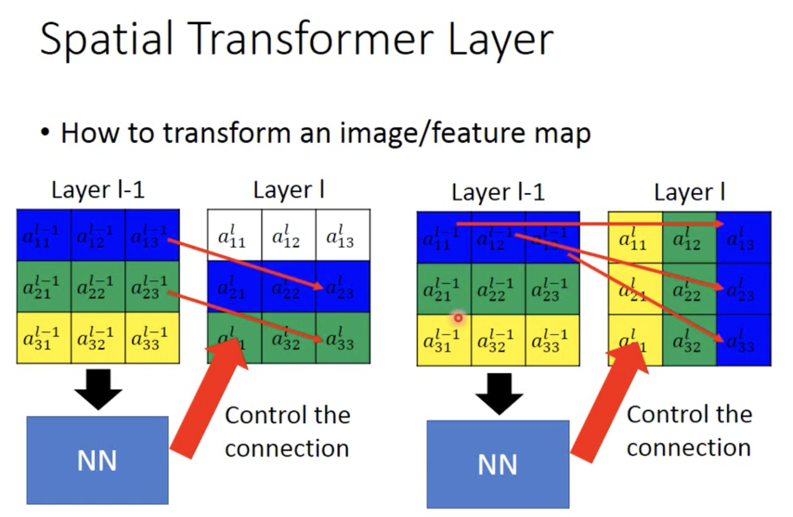
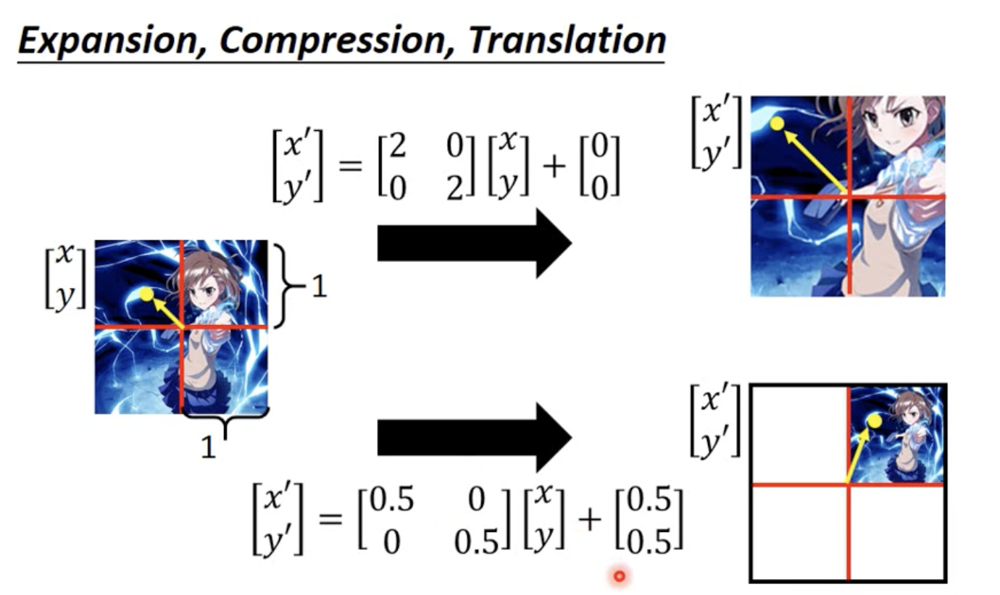
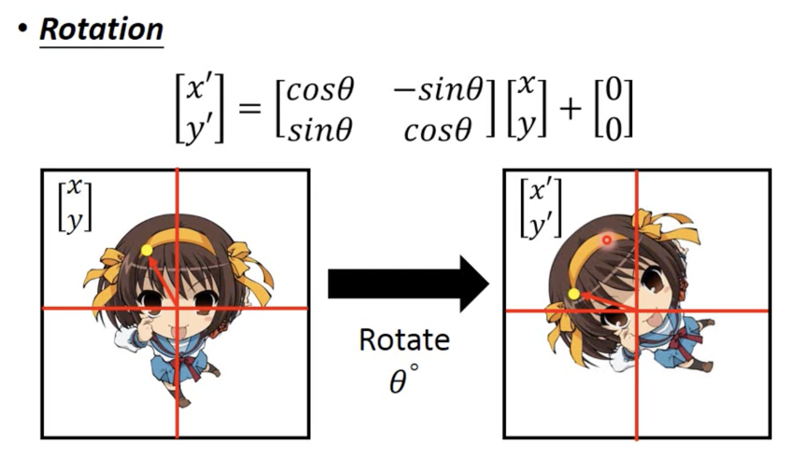
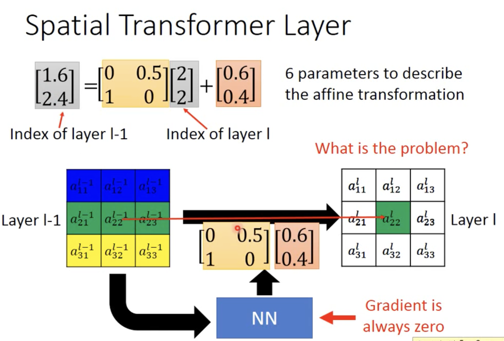
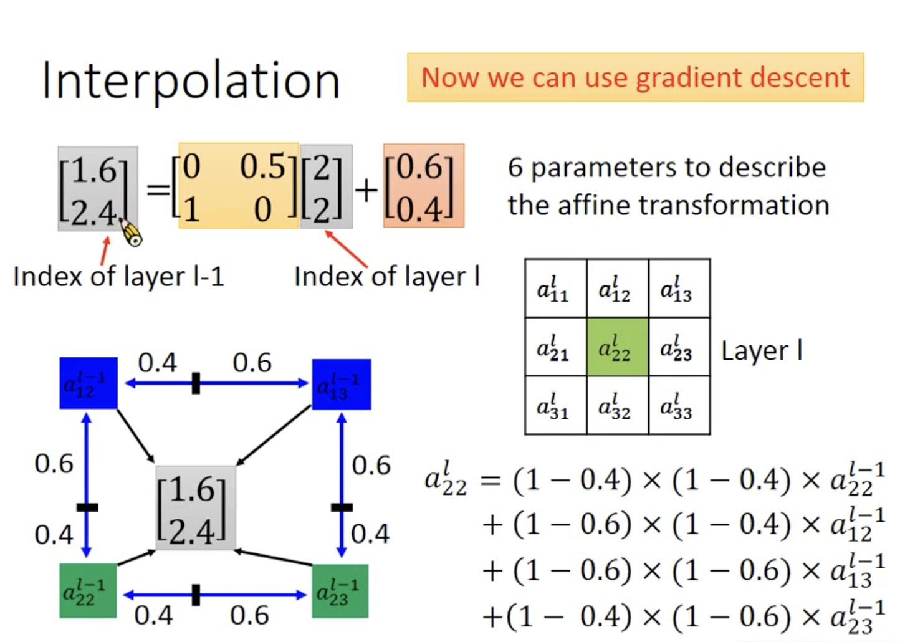

- Spatial Transformer 空间变换器
	- CNN 对image的旋转和缩放并不鲁棒，可能一张小狗的图片进行放大它就是认不出是小狗了
	- 而 spatial transformer layer 能够对image进行平移旋转缩放，然后再给CNN，这样就能缓解鲁棒性问题

- spatial transformer 的示意
	- 平移和缩放
	- 缩放
	- 旋转

- spatial transformer 的结构
	- 总计就是 6 个参数
	- 如果参数不是整数就会算出来奇怪的值，这样如果我们直接采用最近的去替换就会产生问题，比如1.6和2.4略微改变，会导致结果不变因此梯度会是zero这样难以更新，你可以想想分段函数，每段都是常数，这样每段梯度不都是0吗
	- 我们直接找新位置应该由哪些原位置得到，而不是算原位置去哪些新位置，因此下面式子就是正向的(这样更加顺畅)
	-  
	- 采用插值法(双线插值)，将最近邻的都加起来，这样参数改变也会引起$a^l_{22}$ 的改变
	- 