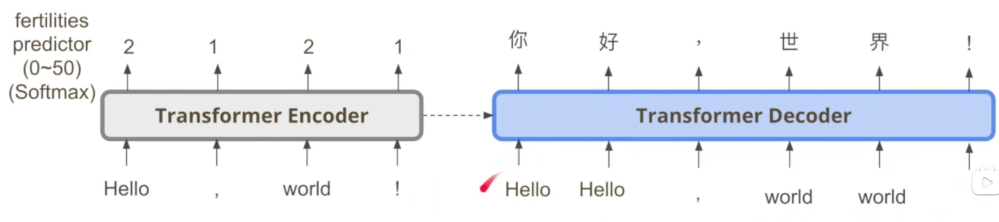
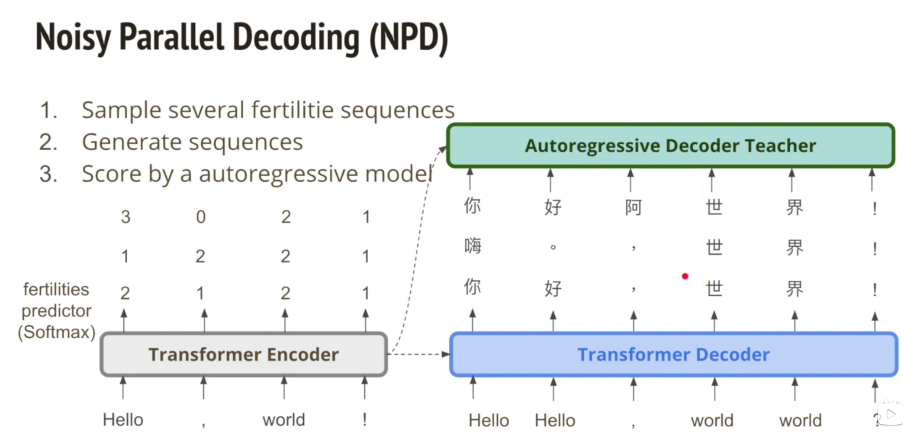
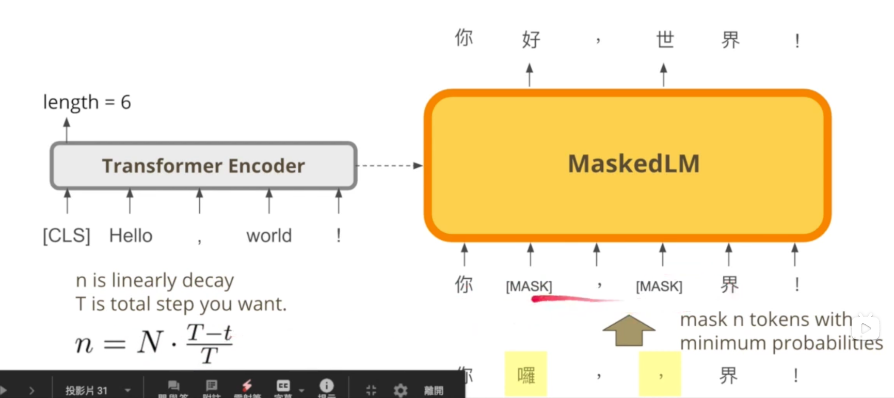
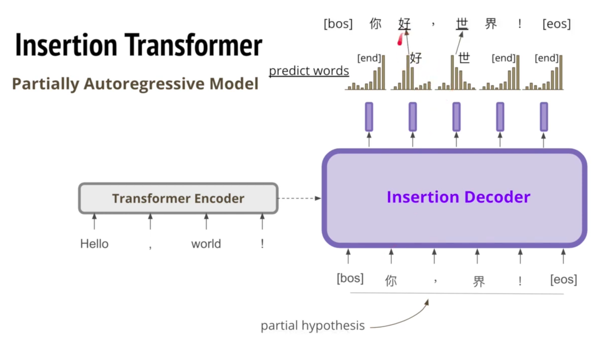
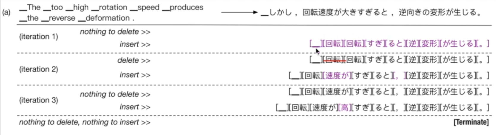

- NAT 非自回归式
	- 它的目标是摈弃自回归的串行，而在Decoder过程中也一样使用并行

- Vanilla NAT
	- 图示
- NPD(Noisy Parallel Decoding)
	- 图示

- Mask-Predict --- Iterative
	- 基于 BERT 概念，不断优化 mask 的部分
	- 图示 

- KERMIT --- Insertion
	- 图示 
	- 上述图示是 Insertion Transformer 的，KERMIT 也是基于 Insertion 的，不过它的模型结构类似于BERT，没有分隔开的Encoder和Decoder

- Levenshtein Transformer --- delete + Insertion
	- 图示 
	- delete -> insert -> token

- CTC -> Imputer(CTC + Mask-Predict)
	- CTC 常用于语音识别任务，它的 Seq2Seq 两者长度相同，但是它有 space token，最终的结果应该是去掉 space token 和 冗余token

