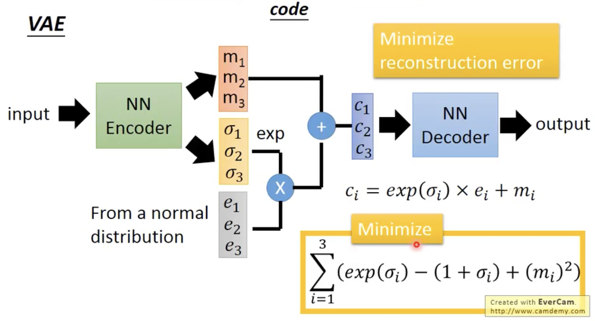

- VAE的结构
	- 

- 为什么要用 VAE
	- 原先的 Auto-Encoder 在 Encoder 之后会得到降维表示(code)，但是 code 之间的演变关系其实是不清楚的，比如 满月的 code 和 上弦月 code 的均值 code 经过 Decoder 之后变成什么样我们其实并不知道
	- VAE 的原始动机就是希望 上述的均值 code 经过 Decoder 之后能变成 上半满月，它的实现逻辑就是在 code 中添加 noise，这样有一段code都应该生成满月，这可能与生成上弦月的一段code有重叠部分，这样重叠部分为了减少损失可能就会同时携带两者信息，成为 上半满月

- VAE Encoder 的输出
	- $m_i$ 表示原始的 code(也可以看作控制 noise 的均值)
	- $\sigma_i$  用于控制 noise 的方差(分布)
		- 由于方差是正的因此需要取指数
		- 所以也可以视作输出的是 $log\sigma$
	- 基于上述的 ==Reparameterization 重参数化==方法能够让 *噪声分布* 的影响梯度化进而作用于Encoder --- 固定噪声分布 + 可学习变换
	- 如果依然只是最小化重建损失，那么模型可能会将 $\sigma$ 全学作 0，这样就是常规的 Auto-Encoder
		- 因此增添最小化  $exp(\sigma)-(1+\sigma) + (m)^2$ 的条件 就是为了让 方差尽量贴近 1，均值尽量贴近 0，也就是不要过于远离 标准高斯分布

- 在数学层面上，从 Gaussian Mixture Model 开始分析 VAE
	- 这里的推导和公式较多，也比较繁琐，笔记中就不记录了，只是理解
	- 可以查看课程的对应片段
	-  z|x 与 x|z，其实 Decoder 也应该输出两项即 均值 和 方差，但是在实际过程中，Decoder 只用输出 均值，用均值 和 input 构成重建损失

- VAE 的问题
	- 它并不真正尝试模拟真实图像，VAE可能只是记住现有图像，而不是生成新图像
	- 而 GAN 确实真正的想去让生成图片像真实图片