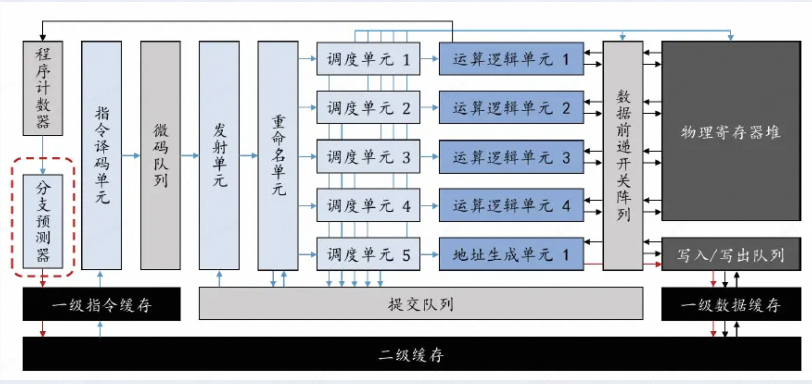
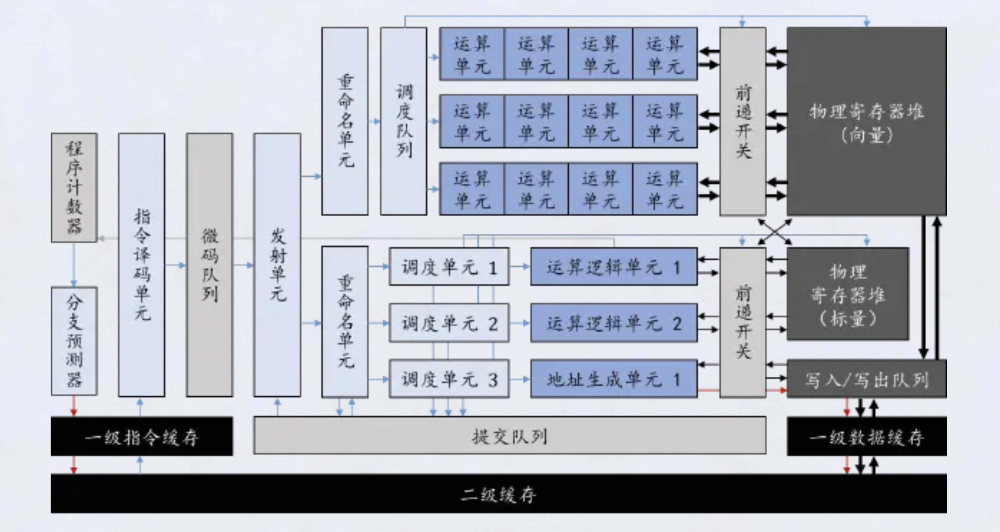
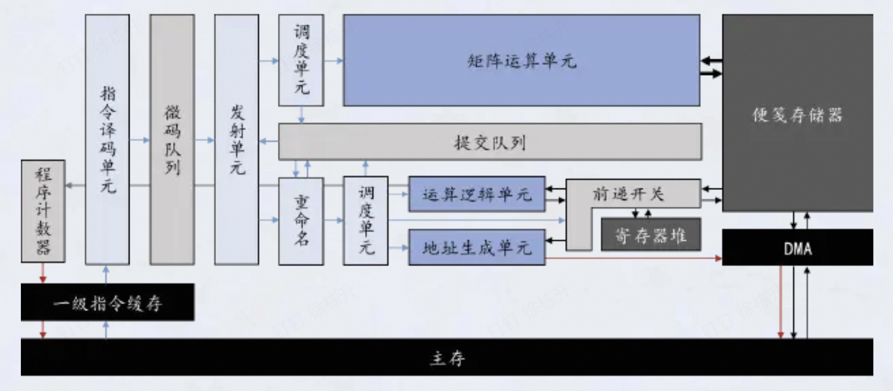
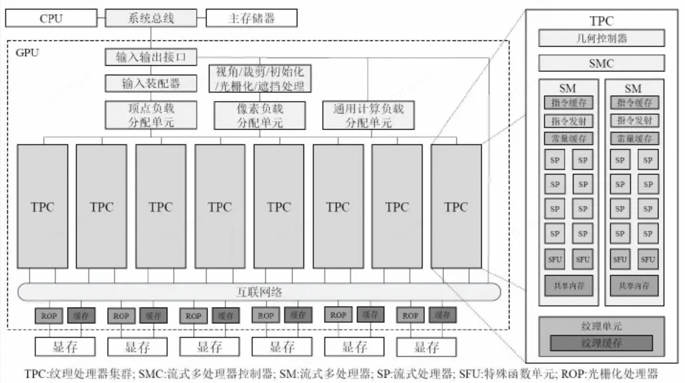
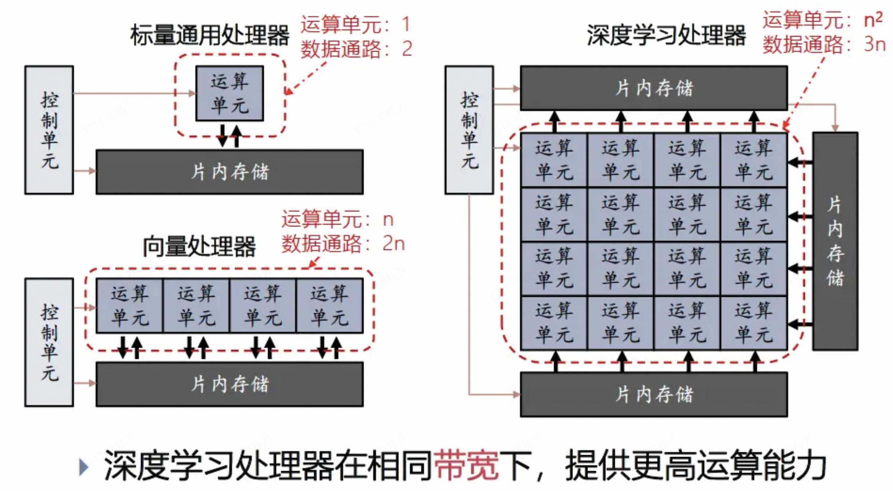

## 四种常见的处理器

- CPU 通用
	- 
- GPU 图形/向量
	- 
- FPGA 定制
- DLP 深度学习处理器/矩阵
	- 

现代CPU+GPU架构

## 运算密度

- 运算密度 = 运算量 / IO数据量
- 标量乘 1、3
- 向量乘 n、3n
- 矩阵向量乘 $n^2$ 、 $n^2$ 
- 矩阵矩阵乘 $n^3$ 、 $n^2$

## CPU\GPU\DLP的运算单元

- DLP 相对 GPU 主要是更充分的数据复用，而不用 反复取值

- 以 $n\times n$ 矩阵乘法 C=AB 为例辨析 Vector Processor 与 DLP
	- Vector Processor
		- 典型结构：n 个 vector lanes
		- 每次向量操作大约完成 n 个乘加。
		- 总计算量为 $n^3$，因此需要约 $n^2$ 轮向量计算。
		- 数据主要由 Vector Register / Cache 反复向计算 lane 供给。
		- 数据复用主要依赖寄存器和缓存，而不是计算阵列本身。
		- $n^2\text{ 轮}\times O(n)\text{ 供数}$
	- DLP
		- $n\times n=n^2$ 个 PE
		- 每轮取入：
			- A 的一列：n 个元素
			- B 的一行：n 个元素
			- 共约 2n 个新数据。
		- 这些数据在二维 PE 阵列中广播/传播，每个数据被多个 PE 复用。
		- 一轮可完成 $n^2$ 个乘加。
		- 一共进行 n 轮即可完成矩阵乘法。
		- $n\text{ 轮}\times O(n)\text{ 供数}$

|       | Vector Processor | DLP         |
| ----- | ---------------- | ----------- |
| 计算单元  | O(n)             | O(n^2)      |
| 每轮计算量 | O(n)             | O(n^2)      |
| 计算轮数  | O(n^2)           | O(n)        |
| 数据复用  | Register / Cache | PE 阵列内广播、传播 |
| 主要优势  | 通用、灵活            | 高数据复用、高计算密度 |

因此：

$$\boxed{\text{DLP 的优势不是减少计算量，而是减少数据搬运}}$$