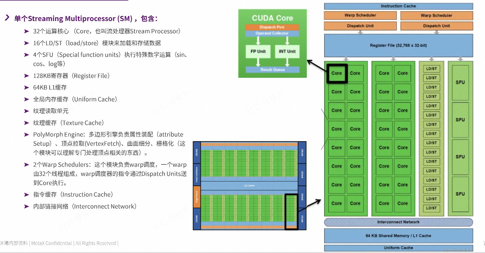
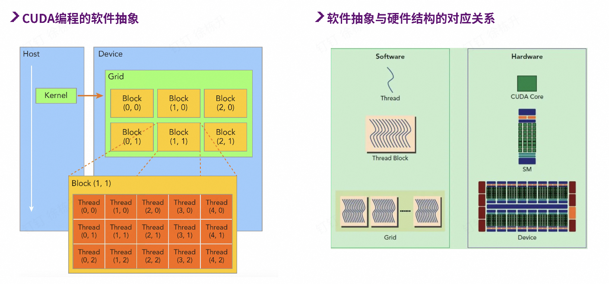
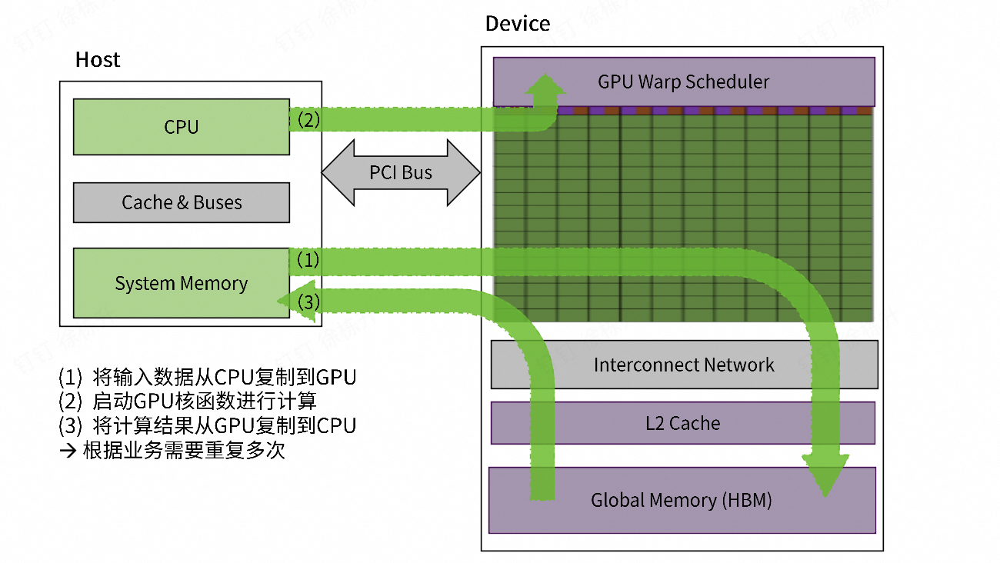
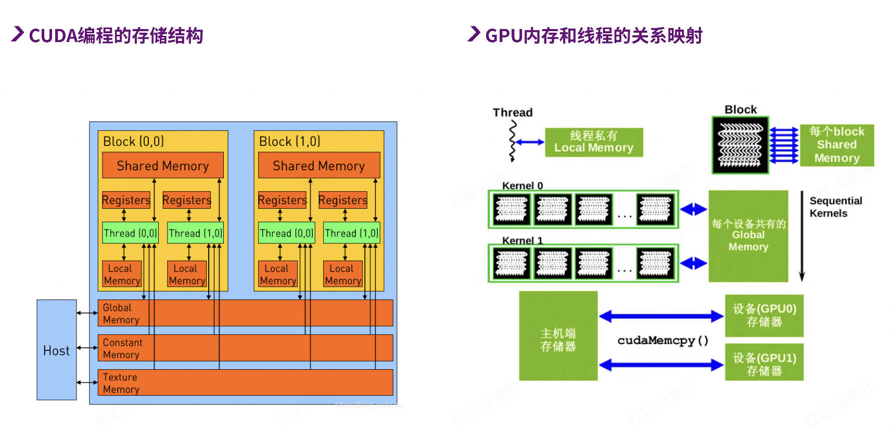
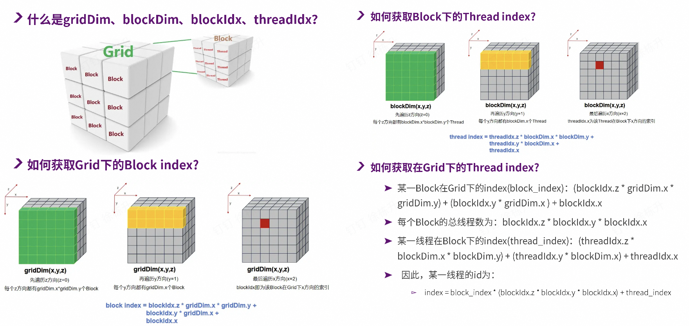

>[!notice] 本节重点
>- 本节主要讲 CUDA 编程 和 GPU 的硬件架构，重点在于理解 GPU 的底层体系结构，并串联理解 软件抽象 和 硬件逻辑
>- 最重要的应该是 GPU体系结构 小节
## GPU 微架构演变

GPU 简史

- CPU + 加速卡 1970-1999
- GPU 固定功能渲染pipeline 1999-2006
- GPU 可编程pipeline 2006-now
	- 2002 --- GPGPU General Program GPU
		- 能够适配科学计算，但是需要研究人员很熟悉GPU
	- 2004 --- 流式处理器思维
		- CPU (程序programs) + GPU(设备核函数kernels)
	- 2006 --- CUDA诞生
		- 为了流式处理器方便写kernels，而研制出 CUDA 语言进行编程(C/C++通用API)
		- MXMACA 是沐曦类似CUDA的编程语言

## GPU 体系结构

执行模型

- ILP 指令并行 vs SIMT线程并行
	- CPU 是 ILP 指令并行，乱序执行与分支预测的指令级并行
	- GPU 是 SIMT 单指令多线程，单指令多线程并行
	- 

GPU体系结构

- warp/wave 调度
	- GPU并行调度的最小粒度，通常32/64线程，以 束 为单位同步发射和执行
- SIMT执行模型
	- 同一warp/wave 内的所有线程在同一时钟周期执行同一条指令，但是可以处理不同的数据
- SM/AP架构
	- 由大量精简的 Streaming Processor(CUDA core)组成，舍弃了复杂控制逻辑与缓存层级
	- 以 NVIDIA Fermi 架构为例
	- 

GPU的线程层次

- Grid -> Device
- Thread Block -> Accelerator Processor
- Thread -> Scalar Processor

=== "软件抽象"
	

=== "CPU&GPU"
	

=== "存储结构"
	

=== "索引"
	